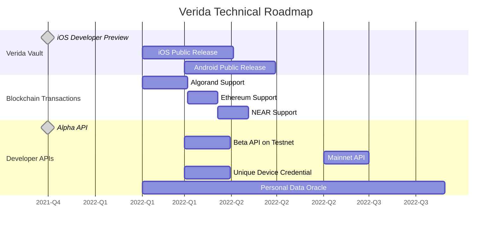

## Capabilities 

The major capabilities of the Verida developer platform are as follows:

<table>
<tr><th>Capability</th><th>Released</th><th>Links</th></tr>
<tr>
    <td align="left">Identity</td>
    <td align="center">✅ </td>
    <td align="left">
        <ul>
            <li><a href="https://accounts.verida.io">Verida Account Explorer</a></li>
            <li><a href="/docs/concepts/accounts-and-identity">Documentation: Accounts and Identity</a></li>
        </ul>
    </td>
</tr>

<tr>
    <td align="left">Single Sign On</td>
    <td align="center">✅ </td>
    <td align="left">
        <ul>
            <li><a href="/docs/tutorial/SSO">SSO Interactive Example</a></li>
            <li><a href="/docs/single-sign-on-sdk">Documentation: How to use the SSO SDK</a></li>
        </ul>
    </td>
</tr>

<tr>
    <td align="left">Messaging</td>
    <td align="center">✅ </td>
    <td align="left">
        <ul>
            <li><a href="/docs/tutorial/messaging">Messaging Interactive Example</a></li>
            <li><a href="https://vault-examples.demos.verida.io/">Demo: Vault Example</a></li>
        </ul>
    </td>
</tr>

<tr>
    <td align="left">Secure Data Storage</td>
    <td align="center">✅ </td>
    <td align="left">
        <ul>
            <li><a href="/docs/client-sdk/data">Documentation: Data</a></li>
            <li><a href="/docs/client-sdk/data">Documentation: Queries</a></li>
            <li><a href="/docs/tutorial/databases">Interactive Example: Databases</a></li>
            <li><a href="/docs/tutorial/encyption">Interactive Example: Data Encryption</a></li>
        </ul>
    </td>
</tr>

<tr>
    <td align="left">Personal Data Sharing</td>
    <td align="center">✅ </td>
    <td align="left">
        <ul>
            <li><a href="https://vault-examples.demos.verida.io/">Demo: Vault Example</a></li>
        </ul>
    </td>
</tr>

<tr>
    <td align="left">Verifiable Credentials</td>
    <td align="center">✅ </td>
    <td align="left">
        <ul>
            <li><a href="/docs/concepts/verifiable-credentials">Documentation: Verifiable Credentials</a></li>
            <li><a href="https://vault-examples.demos.verida.io/">Demo: Vault Example</a></li>
        </ul>
    </td>
</tr>

<tr>
    <td align="left">Vault Token Transfers</td>
    <td align="center">✅ </td>
    <td align="left">
        <ul>
            <li><a href="https://vault.verida.io">Available in the Verida Vault</a></li>
        </ul>
    </td>
</tr>

<tr>
    <td align="left">Unique Device Credential</td>
    <td align="center">In Development</td>
    <td align="left">
        <ul>
            <li><a href="#roadmap">Roadmap</a></li>
        </ul>
    </td>
</tr>

<tr>
    <td align="left">Personal Data Oracle</td>
    <td align="center">In Development</td>
    <td align="left">
        <ul>
            <li><a href="#roadmap">Roadmap</a></li>
        </ul>
    </td>
</tr>

</table>

## Roadmap

