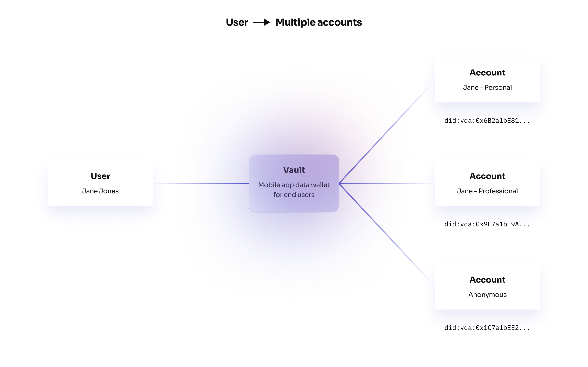

# Accounts and Identity

# Decentralized Identitifers (DIDs)

Verida accounts are [decentralised identities (DID)](https://w3c.github.io/did-core/) created on the `Verida DID server`. A DID has a unique addresses (ie: `did:vda:0x6B2a1bE81ee770cbB4648801e343E135e8D2Aa6F`) that is controlled by an end user.

A user can identify themselves to another user or application by sharing their unique DID string.

The Verida Vault automatically creates a decentralized identity for new users. These identities can be exported and imported by providing the secure seed phrase and the DID string for recovery.

# Multiple identities

Users can have multiple identities depending on context. For example, a user may have a `personal` identity and a `professional` identity. This is easily supported (and free) as a user can simply create a new Verida account (DID) and use that to login to any application.

It’s also entirely anonymous. No information is known about the holder of the DID and no personally identifiable information is written to a public blockchain.

# DID Registry

Verida operates a centralized DID registry as a REST server ([Verida DID server](https://github.com/verida/did-server)).

As of writing, there is no suitable decentralized DID registry solution that meets the Verida network’s requirements for performace and cost. This server has been meets the [DID standard](https://w3c.github.io/did-core/) and is designed to be upgradeable to a decentralized DID registry in the near future.

# Data Hosting & Control

A Verida account can control where their private data is stored, for all applications using the account. Data created by applications is encrypted with the account’s private keys and stored in off-chain private peer-to-peer databases.

The database endpoints for this application data is published as part of the account’s public DID registry information.

For simplicity, Verida provides a free testnet database that can be used by any application, however both application developers and users can take control of this data:

1. Application developers can host their own Verida Storage node(s) and configure that to be used for their application. See [storage nodes](../storage-node.md).
2. Users can host their own Verida Storage node(s) and force an application to use that server by updating their DID document with the new server endpoint

<aside>
💡 Data stored on the Verida testnet is deleted regularly, so don’t rely on that data persisting. If you need help spinning up your own dataserver for your application, please contact us.

</aside>