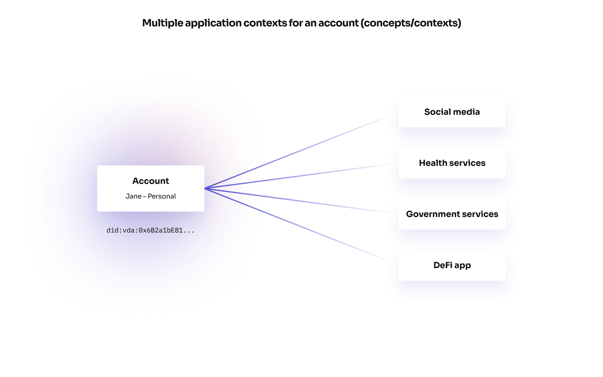

A Verida account can connect to multiple applications. These connections are called application `contexts`.

An application `context` has a unique name (ie: `Verida: Markdown Editor`) and provides a specific set of capabilities:

- Database storage
- Messaging
- Block storage
- Notifications

These application `contexts` are accessed by applications via the [Client SDK](../client-sdk/client-sdk.md).

Application contexts are siloed from each other. A Verida account connected to one application context has no access to data in a different application context. This ensures a web application can only access data for it’s own application and not be provided with an account’s private key.

## Security

An application `context` is “unlocked” by a Verida account signing a consent message. The signature is unique for a given `DID` and `context` name. The signature is used as entropy to create a deterministic set of encryption keys:

- **Symmetric encryption key** — for encrypting private data
- **Asymmetric encryption key** — for encrypting data for other users and applications
- **Signing key** — for signing data

These `context` encryption keyscan only be generated from the consent signature generated by the account when logging into an application. The signature is used as a seed to create a [Hierarchical Deterministic Wallet](https://www.investopedia.com/terms/h/hd-wallet-hierarchical-deterministic-wallet.asp), which in turn, is used to generate multiple child keys.

## Discoverability

When a new application `context` is created, metadata about the account and the `context` is published to the account’s DID document on the `Verida DID server`. This information includes:

- The (asymmetric and signing) public keys
- Database endpoint
- Messaging endpoint
- Block storage endpoint
- Notification endpoint

This allows other users and applications in the Verida network to discover information per context:

- The endpoint used to communicate with an account
- Encrypt data for an account using it’s public asymmetric key
- Verify data signed by an account using it’s public signing key

Through this approach, user’s have complete control over where their personal data is stored.