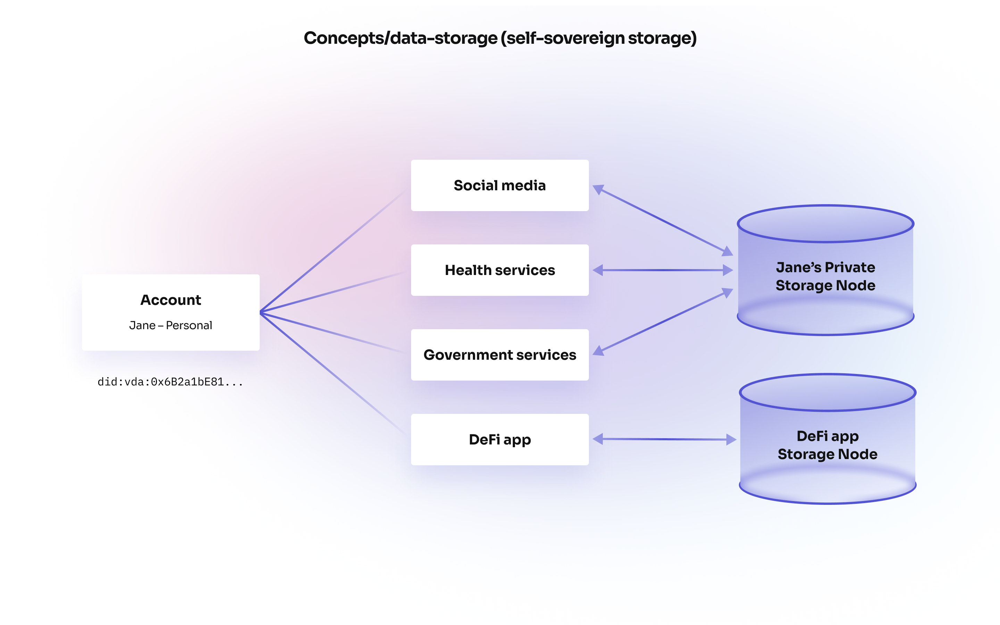

# Data Storage

# Self-sovereign storage

Verida accounts control where their personal encrypted data is stored. Applications can provide a default storage hosting option or users can specify their own.

Self sovereign storage owned and controlled by end users on the Verida network

This diagram shows a single user with data spread across four applications, but data stored in two separate locations. One location is managed by Jane, the other is managed by a third party application. In both cases, Jane's data is encrypted before it is stored. These locations could be on different servers, data centres or different countries.

In this way, a simple onboarding exists for new users, while more advanced users can host their own data.

# How data is stored

Under the hood a combination of [CouchDB](https://en.wikipedia.org/wiki/Apache_CouchDB) and [PouchDB](https://pouchdb.com/) is used to store user data. Here’s why that combination was chosen over other options:

- CouchDB was released in 2005. It is well supported and battle hardened over the years. This meets the principle: `Suitable for Enterprise use`.
- CouchDB supports multi-master replication and multi-version concurrency control (MVCCC) making it ideally suited to synchronise data between applications. This meets the principle: `Write once, use everywhere`.
- CouchDB supports custom user permissions. This meets the principle: `Security must not be compromised`.
- PouchDB is a Javascript implementation of CouchDB that can run within a web browser (or mobile app) enabling user data to be encrypted within the web browser before being sent to CouchDB, while still enabling full database query support of the encrypted data. This meets the principles: `Security must not be compromised` and helps on-board new developers by providing well known query capabilities.

At the end of the day, data must be physically stored somewhere. Verida Client SDK is designed to empower user’s to control where their data is stored. This meets the principle: `Put the user first`.

# Data synchronisation

Applications built with Verida Client SDK can syncronize data between other users and other applications, using the CouchDB syncronization protocol.

Data from multiple applications using the same schemas can be synchronized automating conflict management. This works in a similar way to a `git merge`, but for database data.