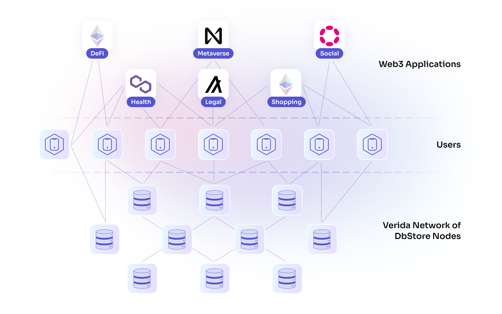

## Why does Web3 need Verida's Data Storage Network?

There are a range of decentralized data storage options for Web3, however they suffer from some fundamental drawbacks:

1. No built-in encryption for private data
2. Users have no control over where their data is stored
3. Users have no ability to "self-host" their data
4. Not GDPR compliant
5. Poor performance (much slower than Web2 storage)

Verida solves all these data storage problems in a way that is capable of scaling to billions of users. It enables decentralized apps to be built that can have comparable features, performance and cost of Web2 applications.

We have written an overview of the types of Web3 data that provide helpful background information and context for where the Verida Network offers the biggest value as a data storage solution.

[Learn more: Where to store Web3 data?](../extras/where-to-store-web3-data)

## Where is data stored?

User data is stored on Verida [Storage Nodes](../infrastructure/storage-node) connected to the Verida Network. This offers a publicly available, decentralized, globally distributed collection of encrypted storage nodes.

The Verida Network architecture allows users to determine which nodes on the network store their data, or even self-host and use their own private nodes.

Users grant access to applications to access and decrypt portions of their data stored on nodes across the network.

It is currently possible to manage this via our client SDK, but that is not a suitable user experience for the vast majority of users. In the future the Verida Wallet will provide a user interface allowing users to easily manage and control where their data is stored.

## How is data kept secure?

User data is encrypted using private keys stored on the end user's device. For example, if a user logs into an application in their web browser, an encryption key is generated in the Verida Wallet and sent to the user's web browser. This then enables the user's browser to encrypt and decrypt all their data. Any data sent to a storage node has already been encrypted and can't be decrypted without the user's key.

In addition, storage nodes only accept requests that have been authenticated by the owner of the data. Unlike other Web3 storage solutions where all data is publicly readable, the Verida Network has both access controls (read, write, delete) in addition to the built-in encryption.

This provides Web2 level security to user data for Web3.

[Learn more: Client SDK / Permissions](../client-sdk/permissions)

## How is application data kept separate from each other?

Verida Accounts have multiple containers for storing data (called [application contexts](./application-contexts)). Each of these `application contexts` are completely independent. They have independent storage nodes storing their data, encryption keys with the data completely isolated from other `application contexts`.

Self sovereign storage owned and controlled by end users on the Verida Network

This diagram shows a single user with data spread across four applications, but data stored in two separate locations. One location is managed by Jane, the other is managed by a third party application. In both cases, Jane's data is encrypted before it is stored. These locations could be on different servers, data centres or different countries.

[Learn more: Application Contexts](./application-contexts)

## How is data guaranteed to be available?

User data is replicated across multiple storage nodes on the Verida Network. By default the Verida Wallet selects three storage nodes to store user data; providing three replicas of all the data. The network architecture allows users to select an unlimited number of storage nodes to store their data (and which nodes).

This ensures tht if one of the storage nodes becomes unavailable, there are two other nodes that still have copies of the data and the user can continue uninterrupted.

The built-in replication and recovery of the network ensures that when a node comes back online, it will automatically "catch up" with data it missed and then come back online.

## How is data stored under the hood?

Under the hood a combination of [CouchDB](https://en.wikipedia.org/wiki/Apache_CouchDB) and [PouchDB](https://pouchdb.com/) is used to store user data. Here’s why that combination was chosen over other options:

- CouchDB was released in 2005. It is well supported and battle hardened over the years. This meets the principle: `Suitable for Enterprise use`.
- CouchDB supports multi-master replication and multi-version concurrency control (MVCCC) making it ideally suited to synchronize data between applications. This meets the principle: `Write once, use everywhere`.
- CouchDB supports custom user permissions. This meets the principle: `Security must not be compromised`.
- PouchDB is a Javascript implementation of CouchDB that can run within a web browser (or mobile app) enabling user data to be encrypted within the web browser before being sent to CouchDB, while still enabling full database query support of the encrypted data. This meets the principles: `Security must not be compromised` and helps on-board new developers by providing well known query capabilities.

At the end of the day, data must be physically stored somewhere. Verida Client SDK is designed to empower user’s to control where their data is stored. This meets the principle: `Put the user first`.

## How is data synchronized between applications?

Applications built with Verida Client SDK can syncronize data between other users and other applications, using the CouchDB synchronization protocol.

Data from multiple applications using the same schemas can be synchronized automating conflict management. This works in a similar way to a `git merge`, but for database data.

The Verida Wallet provides an interface for requesting access to sharing data and automatically handles creating these data synhcronization rules between applications.

[Learn more: Data Sharing](./data-sharing)

## How do Verida Accounts authenticate with Storage Nodes?

This is the authentication flow:

1. The Verida Account makes a request to the storage node API to obtain an auth JWT to be signed (`/auth/generateAuthJwt`). This prevents replay attacks.
2. The Verida Account signs a consent message using their private key. This consent message proves the user wants to unlock a specific application context
3. The Verida Account submits the signed authorization request (`/auth/authenticate`). Assuming the signed AuthJWT is valid, the storage node returns a refresh token and an access token
4. The Verida Account can then use the access token to either; 1) make storage node requests (ie: create database) or 2) directly access CouchDB as an authenticated user (using `Bearer` token auth)
5. When the access token expires, the Verida Account can use the refresh token to request a new access token (`/auth/connect`)
6. If a refresh token is close to expiry, the Verida Account can use the active refresh token to obtain a new refresh token (`/auth/regenerateRefreshToken`)

When a Verida Account authenticates, it can designate an `authenticate` request to be linked to a particular device by specifying the `deviceId` in the request.

This allows a specific device to be linked to a refresh token. A call to `/auth/invalidateDeviceId` can be used to invalidate any refresh tokens linked to the specified `deviceId`. This allows the Verida Wallet to remotely log out an application that previously logged in.

Note: This only invalidates the refresh token. The access token will remain valid until it expires. It's for this reason that access tokens are configured to have a short expiry (5 minutes by default). CouchDB does not support manually invalidating access tokens, so we have to take this timeout approach to invalidation.