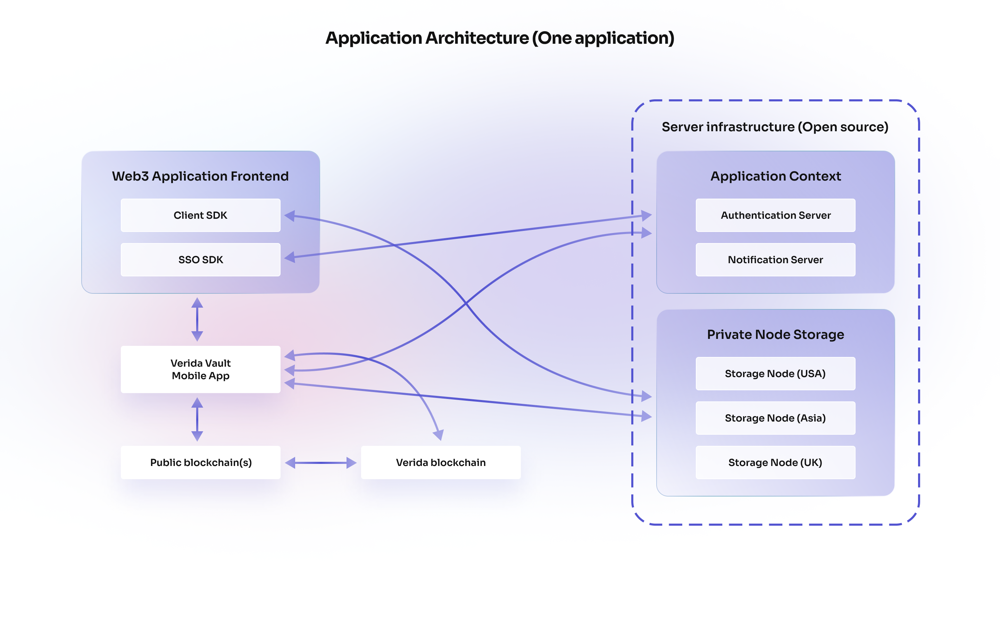

# Network Architecture

## Overview

Verida is a network of users with decentralized identities that can access decentralized services (Verida Network). These services include private database storage, messaging and notifications. In time, this will be expanded to include block storage, blockchain access, on/off chain data bridges and trust services.

Verida provides a reference implementation of a “Data Wallet” (Verida Vault), a mobile application for end users to create decentralized identities, securely store their private keys, and interact with the Verida network.

Verida has a roadmap of network extensions that expand its capabilities towards a global network of trusted, private, verifiable, self-sovereign data that can power a personalized Web3 future.

## Decentralized Identity

Decentralized Identities are a [W3C standard](https://www.w3.org/TR/did-core/) and core to user identities using the Verida Network. The Verida network enables user’s to maintain private keys / seed phrases to control their decentralized identity.

The user’s public keys are used to find and communicate with them. Users control their private keys, enabling them to:

- Encrypt and access their private data
- Control where their data is stored
- Sign their data and messages to third parties
- Pay for third party data storage
- Sign into decentralized applications

[Learn more](accounts_and_identity.md)

## Vault

The Verida Vault is a mobile application that acts as both a “Data Wallet” and a “Crypto Wallet” for end users. It provides private key management and a user-friendly interface for interacting with the Verida network and supported blockchains.

The Vault provides users with the following core capabilities:

- **Identity:** Allows users to create new decentralized identities, blockchain wallets, manage their private keys and facilitate single sign-on across an ecosystem of decentralized apps.
- **Single Sign On:** Simple, consensual authentication and authorization with decentralized applications developed on the Verida network.
- **User Data:** Allows users to browse their decrypted data, consensually share their data, allow it to be queried without sharing or move their data to a different storage service.
- **Inbox:** A secure data inbox allows messages, requests and data to be received by end users and then actioned.
- **Profiles:** Users can create and manage both public and private profiles that can be shared with third parties.
- **Tokens and Transactions:** Users can interact with any supported blockchain by signing transactions, transferring assets, managing NFTs etc. Users can also earn Verida token rewards by simply using the network.

[Learn more](https://www.verida.io/user-vault)

<aside>
💡 Phase 1 launch of the Vault supports the “Data Wallet” capabilities, with the crypto wallet capabilities coming in phase 2.

</aside>

## Client SDK

An open source implementation of a Verida network client enabling developers to build applications that access encrypted private storage, identity, messaging, and schemas capabilities.

It is an easy-to-use library that abstracts the complexities behind these capabilities, thereby allowing developers to build self-sovereign applications.

[Learn more](../client_sdk/client_sdk.md)

## Single Sign On (SSO) SDK

A decentralized single sign on SDK that enables seamless QR code authentication via the Verida Vault mobile application.

It provides a seamless user experience to onboard new users to the Verida network, new decentralized applications and the full range of supported blockchains.

Signed in users are provided with a private encrypted collection of databases for the application, secure messaging and ability to perform blockchain transactions.

[Learn more](../single_sign_on_sdk/single_sign_on_sdk.md)

## Storage Nodes

Verida provides secure database storage and encryption for private user data. No user data or personally identifiable information (PII) is stored on-chain.

Verida has developed a PouchDB/CouchDB database implementation with open source middleware (Verida Storage Node). This solution is designed for storing private user data, incorporates access controls with flexible encryption and permissioned data synchronization. It is designed to be region aware and meet GDPR requirements. The storage node provides a middleware authentication layer that connects traditional database technology with decentralized identities.

The current landscape of decentralized database storage technologies is rapidly evolving. As such, it’s possible other decentralized database storage options will soon reach maturity where they meet the security expectations, access controls and features to a level they can be supported by the Verida network.

User data is stored in isolated [application contexts](./04-contexts), where the data from one application can not be accessed by another application without the explicit consent of a user. This ensures users can selectively disclose their personal data to different applications on an as-needs basis, providing enhanced privacy and data security.

[Learn more](../storage_node.md)

## Blockchain

Phase 2 of the Verida network will incorporate many new capabilities that can be leveraged by application developers. This includes:

- Bridging off-chain data across multiple chains
- Trusted interactions with on-chain addresses and smart contracts
- Token rewards for adding valuable data to the network

Further details will be made available in our upcoming Whitepaper.