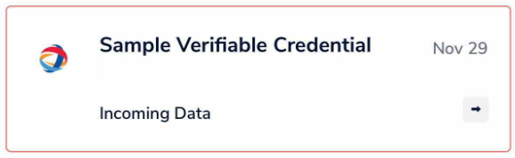
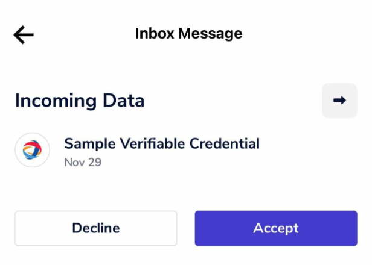
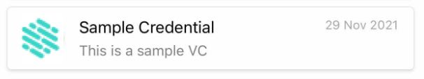

# Verifiable Credentials

Verifiable Credentials are are [W3C standard](https://www.w3.org/TR/vc-data-model/) used extensively within the Verida network. This page summarises the Verida developer APIs and how they operate within the platform. 

## Sample code

This sample code can be used within the [Verida Web Sandbox](https://web-sandbox.demos.testnet.verida.io/):

```jsx
const CONTEXT_NAME = "Verida: Credential Sample";
const VERIDA_TESTNET_DEFAULT_SERVER = "[https://db.testnet.verida.io:5002/](https://db.testnet.verida.io:5002/)";
const account = new window.VaultAccount({
	defaultDatabaseServer: {
		type: "VeridaDatabase",
		endpointUri: VERIDA_TESTNET_DEFAULT_SERVER,
	},
	defaultMessageServer: {
		type: "VeridaMessage",
		endpointUri: VERIDA_TESTNET_DEFAULT_SERVER,
	},
});
const context = await window.Network.connect({
	client: {
		environment: "testnet",
	},
	account: account,
	context: {
		name: CONTEXT_NAME,
	},
});
const did = await account.did();
const type = "inbox/type/dataSend";
const config = {
	recipientContextName: "Verida: Vault",
};
const test = {
  name: "Sample Credential",
  summary: "This is a sample VC",
	fullName: "Lee Choi",
	dateOfBirth: "1992-01-30",
	schema: "https://assets.verida.io/documentation/sample_schema.json",
	testTimestamp: new Date().toISOString(),
	result: 'high-level'
}

const didJwtVc = await context.getAccount().createDidJwt(CONTEXT_NAME, test);

const data = {
data: [
	{
		...test,
		didJwtVc,
	},
],
};
const message = "Sample Verifiable Credential";
const messaging = await context.getMessaging();
await messaging.send(did, type, data, message, config);
```

## Vault User Experience

 

When a Verida Vault user receives a credential sent using the code above their experience will as follows. 

Firstly they will receive an operating system (iOS/Andorid) notification. The iOS notification looks like this:


`Sample Verifiable Credential` is the content of the `message` set here:

```jsx
const message = "Sample Verifiable Credential";
```

The new message will show up in their Vault inbox. Note that an upcoming release will give the ability to set the icon here. 



The user can click through to accept the message.



Once accepted the credential will show up in the credential list. 



`This is a sample VC` is set in the `summary` field in `data` as follows: `summary: "This is a sample VC"`.

Clicking through to the credential will show the details. An upcoming release will allow another user to verify the credential themselves. 


The data on this screen comes from the following code:

```jsx
const test = {
  name: "Sample Credential",
  summary: "This is a sample VC",
	fullName: "Lee Choi",
	dateOfBirth: "1992-01-30",
	schema: "https://assets.verida.io/documentation/sample_schema.json",
	testTimestamp: new Date().toISOString(),
	result: 'high-level'
}
```

Currently the field names come directly from the data sent. Display field names are the names of the field, with spaces inserted on caseBreaks and the initial letter of each word upper cased. 

 A future version will use the titles set in the [schema sent in the data message](https://assets.verida.io/documentation/sample_schema.json):

```json
    {
      "properties": {
        "result": {
          "title": "Level",
          "type": "string",
          "enum": ["base-level", "high-level"]
        },
        "name": {
          "title": "Credential Type",
          "type": "string"
        },
        "summary": {
          "title": "Summary of Credential",
          "type": "string"
        },
        "fullName": {
          "title": "Full Name",
          "type": "string"
        },
        "dateOfBirth": {
          "title": "Date of Birth",
          "type": "string"
        },
        "testTimestamp": {
          "title": "time stamp",
          "type": "string"
        }
      }
    }
```