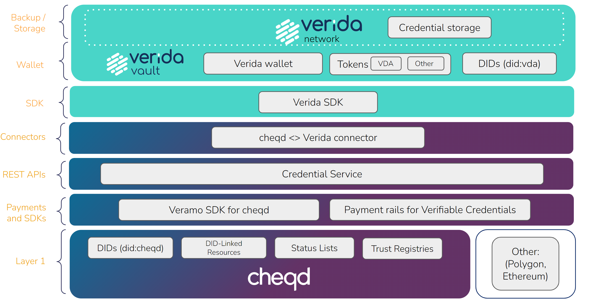

# cheqd Credential Service

The Verida Wallet has full support for [Verifiable Credentials](./verifiable-credentials.md) issued by [cheqd’s Credential Service](https://docs.cheqd.io/identity/credential-service/get-started), a simple way of issuing Credentials over REST API.

Through this integration, the Verida Wallet can support storing, managing and verifying Verifiable Credentials signed by cheqd’s DID Method ([did:cheqd](https://docs.cheqd.io/identity/architecture/adr-list/adr-001-cheqd-did-method)), verifying credential revocation status using cheqd’s approach to status lists on-ledger (see [DID-Linked Resources](https://docs.cheqd.io/identity/architecture/adr-list/adr-002-did-linked-resources)) and soon, charging for revocation status checks.

Below is a diagram which explains how the cheqd and Verida stacks fit together.

## Getting Started

If you want to get started with cheqd’s Credential Service, you can follow the tutorials below.

### Set up your account

Sign up or log-in to access cheqd’s Credential Service APIs. 

[Get started here](https://docs.cheqd.io/identity/credential-service/set-up-account)

### Issue a Credential

Issue, verify and revoke W3C Verifiable Credentials, using did:cheqd for the issuer and did:vda for the subject.

[Get started here](https://docs.cheqd.io/identity/credential-service/credentials)

### Charge for Credentials

Create incentivised payment flows for Credentials, providing a new revenue stream to issuers

[Get started here](https://docs.cheqd.io/identity/credential-service/payments)

### Create DIDs

Create, update and deactivate on-ledger DIDs with cheqd’s DID method (did:cheqd).

[Get started here](https://docs.cheqd.io/identity/credential-service/dids)

## Learn more about cheqd

To learn more about cheqd, head over to their [website](https://cheqd.io) and [developers documentation](https://docs.cheqd.io/identity/getting-started/readme).