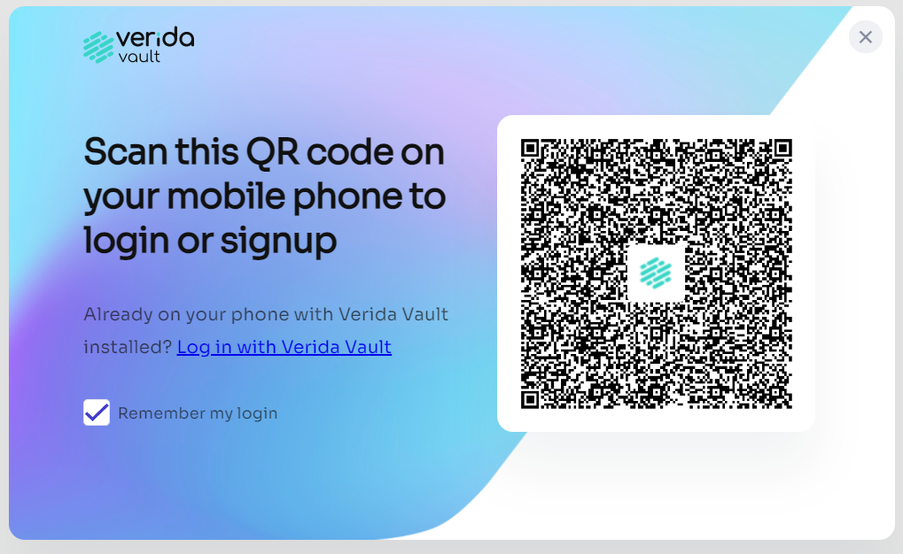
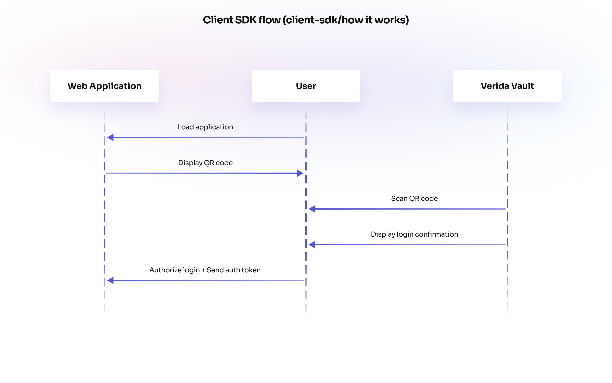

:::caution

The Verida Single Sign On APIs are subject to change during the developer preview phase. 

:::

## What is the Single Sign On (SSO) SDK?

The Verida SSO SDK is a decentralized single sign on client library and server API that enables seamless QR code authentication via the Verida Vault mobile application.

It is an easy-to-use integration method that allows a user to scan a QR code to sign into your application. If the user doesn't have the Verida Vault installed, they will be prompted to install it. Existing users will be prompted to authorize your application to access encrypted storage for that 
application.

### How it works

A user downloads the Verida Vault onto their mobile device which generates a private key on a supported blockchain. This private key is used to generated a Decentralized Identity (DID). The user then scans a QR code on their phone which prompts the user to sign a consent message using the Verida Vault to unlock the secure enclave for that application.

### Further Information

[How to use the SSO SDK](how-to-use-the-sso-sdk.md)

[The SSO Authentication Server](the-sso-authentication-server.md)